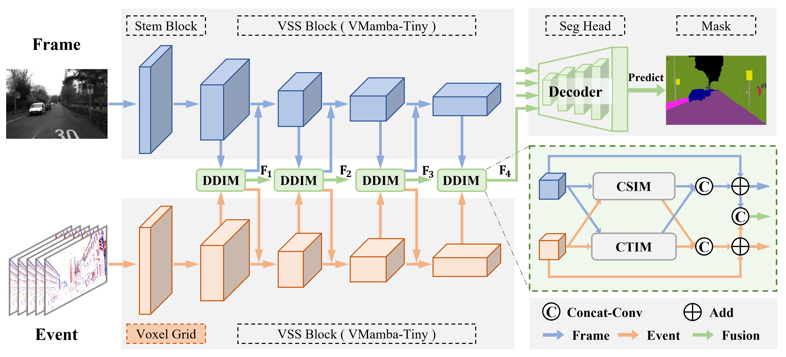

# **MambaSeg: Harnessing Mamba for Accurate and Efficient Image-Event Semantic Segmentation**

Official PyTorch implementation of **MambaSeg**, a state-of-the-art framework for efficient and accurate image-event semantic segmentation based on Mamba.


**[PDF Link (Coming Soon)](INSERT_PDF_LINK_HERE)**

---

## **Method Overview**
  

MambaSeg is a novel dual-branch multimodal semantic segmentation framework that leverages the **Mamba  architecture** for efficient and accurate fusion of **RGB images** and **event data**.  

### **Key Features**
- **Parallel Mamba Encoders**: Efficiently model image and event streams with global receptive fields and linear complexity.
- **Dual-Dimensional Interaction Module (DDIM)**: Combines **Cross-Spatial Interaction Module (CSIM)** and **Cross-Temporal Interaction Module (CTIM)** for fine-grained spatial-temporal fusion.

Extensive experiments on **DDD17** and **DSEC** datasets show that MambaSeg achieves **state-of-the-art (SOTA)** performance while significantly reducing computational cost compared to Transformer-based baselines.

---

## **Performance**
| **Dataset** | **mIoU (%)** | **Accuracy (%)** | **Download** |
|-------------|-------------|-------------------|-------------|
| **DDD17**  | **77.56**   | **96.33**        | [Download](https://drive.google.com/drive/folders/1NruRGwfK-9_Hi7ksXsptI8akbxdalllB?usp=drive_link) |
| **DSEC**   | **75.10**   | **95.71**        | [Download](https://drive.google.com/drive/folders/11ljdJQapiKJqvMtYbGrdX8aCP2xaO-M8?usp=drive_link) |

---

### **Efficiency on DDD17**
| Method    | Params (M) | MACs (G) | mIoU (%) |
|-----------|-----------|---------|---------|
| CMNeXt    | 58.68     | 16.32   | 72.67   |
| EISNet    | 34.39     | 17.30   | 75.03   |
| **MambaSeg** | **25.44** | **15.59** | **77.56** |

---


## **Installation**

MambaSeg is based on **VMamba**, and we follow its recommended installation process.  
**VMamba recommends** setting up a **conda environment** and installing dependencies via `pip`. They **recommend using PyTorch >= 2.0 and CUDA >= 11.8** for the best performance, but lower versions of PyTorch and CUDA are also supported.

Use the following commands to set up your environment:

```bash
# Clone the repository
git clone https://github.com/yourusername/MambaSeg.git
cd MambaSeg
```


```bash
# Create a virtual environment
conda create -n mambaseg python=3.10
conda activate mambaseg

# Install dependencies
pip install -r requirements.txt
cd kernels/selective_scan && pip install .
```
---

## Datasets

### DDD17 Dataset
The original DDD17 dataset with semantic segmentation labels can be downloaded here[https://github.com/Shathe/Ev-SegNet]. Additionally, the pre-processed DDD17 dataset with semantic labels is provided here[https://download.ifi.uzh.ch/rpg/ESS/ddd17_seg.tar.gz]. Please do not forget to cite DDD17 and Ev-SegNet if you are using the DDD17 with semantic labels.

### DSEC-Semantic Dataset
The DSEC-Semantic dataset can be downloaded here[https://dsec.ifi.uzh.ch/dsec-semantic/]. The dataset should have the following format:
```
seq_name (e.g. zurich_city_00_a)
├── semantic
│   ├── left
│   │   ├── 11classes
│   │   │   └──data
│   │   │       ├── 000000.png
│   │   │       └── ...
│   │   └── 19classes
│   │       └──data
│   │           ├── 000000.png
│   │           └── ...
│   └── timestamps.txt
├── events
│   └── left
│       ├── events.h5
│       └── rectify_map.h5
└── images
    └── left
        ├── rectified
        │    ├── 000000.png
        │    └── ...
        ├── ev_inf
        │    ├── 000000.png
        │    └── ...
        └── timestamps.txt
```
Note: Folder "ev_inf" contains paired image samples that are spatially aligned with the event data.


## **Training**

1. **Download** the [VMamba-T](https://github.com/MzeroMiko/VMamba) pretrained weights on ImageNet and place them in the corresponding directory.
2. **Modify** the configuration file under the `configs` folder according to your setup.
3. **Run** the following commands to start training:

### **DDD17 Dataset**
```bash
python train_ddd17.py
```
### **DSEC Dataset**
```bash
python train_dsec.py
```

## **Evaluation**

1. **Set** `EVAL.weight_path` in the configuration file to your trained weights.  
2. **Update** the configuration file path in `evaluate.py`, then run:  
```bash
python evaluate.py
```

## **Visualization**

We provide qualitative visualization results to demonstrate the effectiveness of **MambaSeg**.  
The visualization highlights segmentation performance on **DDD17** and **DSEC** datasets compared to prior methods such as **ESS** (event-only), **SegFormer** (image-only), and **EISNet** (image-event fusion).  

  


## Citation

If you think this implementation is useful for your work, please cite our paper:
```
TMP
```


## Acknowledgement

This work benefits from the following open-source projects:

VMamba: Visual State Space Model

GitHub: https://github.com/MzeroMiko/VMamba
